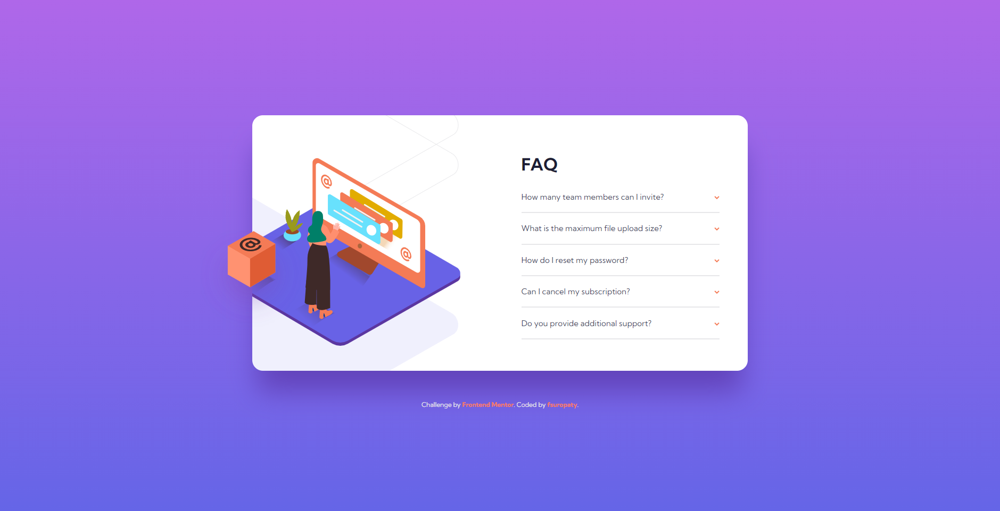
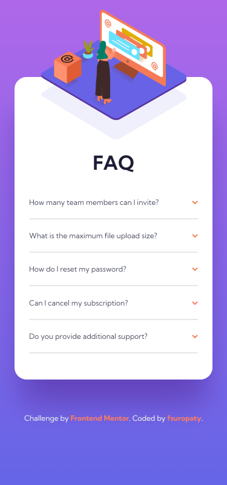

# Frontend Mentor - FAQ accordion card solution

This is a solution to the [FAQ accordion card challenge on Frontend Mentor](https://www.frontendmentor.io/challenges/faq-accordion-card-XlyjD0Oam). Frontend Mentor challenges help you improve your coding skills by building realistic projects.

## Table of contents

- [Frontend Mentor - FAQ accordion card solution](#frontend-mentor---faq-accordion-card-solution)
  - [Table of contents](#table-of-contents)
  - [Overview](#overview)
    - [The challenge](#the-challenge)
    - [Screenshot](#screenshot)
    - [Links](#links)
  - [My process](#my-process)
    - [Built with](#built-with)
    - [What I learned](#what-i-learned)
    - [Continued development](#continued-development)
    - [Useful resources](#useful-resources)
  - [Author](#author)
  - [Acknowledgments](#acknowledgments)

## Overview

### The challenge

Users should be able to:

- View the optimal layout for the component depending on their device's screen size
- See hover states for all interactive elements on the page
- Hide/Show the answer to a question when the question is clicked

### Screenshot




### Links

- Solution URL: [Frontendmentor.io](https://www.frontendmentor.io/solutions/profile-card-component-eBG7O-V96u)
- Live Site URL: [fsuropaty.github.io](https://fsuropaty.github.io/faq-accordion-card-challenge/)

## My process

### Built with

- Semantic HTML5 markup
- CSS custom properties
- CSS Grid
- Mobile-first workflow

### What I learned

I learned about:

- Make Accordion Menu only using HTML & CSS
- Adding icon from CSS
- Animation stuffs
- Changing elements style depends on the state
- Positioning object in CSS

```html
<!-- Accordion Menu -->
<div class="question">
  <input type="checkbox" id="question1" name="checkbox" />
  <label for="question1">How many team members can I invite?</label>
  <p class="answer">
    You can invite up to 2 additional users on the Free plan. There is no limit
    on team members for the Premium plan.
  </p>
</div>
```

```css
/* Adding icon to the end of the question tab */
label::after {
  content: url("./images/icon-arrow-down.svg");
  transition: ease-in 300ms;
}

/* Change elements style depends on the input state */
input:checked + label {
  font-weight: bold;
  font-size: 0.875rem;
}

input:checked ~ .answer {
  max-height: 100vh;
  visibility: visible;
  margin-top: 1em;
  padding-right: 1.5rem;
}

input:checked + label::after {
  transform: rotate(-180deg);
}
```

### Continued development

I wonder if i can make the same styling works with this elements

```html
<details>
  <summary></summary>
</details>
```

### Useful resources

- [W3Schools](https://www.w3schools.com) - Pretty much your guidebook in website development
- [MDN](https://developer.mozilla.org) - W3Schools but from Mozilla.
- [Codepen.io](https://codepen.io) - For some codes

## Author

- Website - [fsuropaty]()
- Frontend Mentor - [@fsuropaty](https://www.frontendmentor.io/profile/fsuropaty)

## Acknowledgments

Thanks to [Raúl Barrera](https://codepen.io/raubaca) on [Codepen.io](https://codepen.io) for the pure css accordion menu [pen](https://codepen.io/raubaca/pen/PZzpVe)
